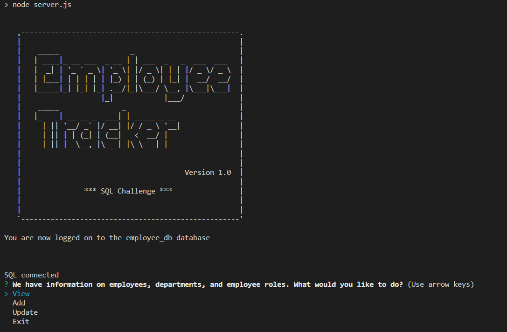

# Employee Tracker

## Description
This is the Employee Tracker challenge for the week of SQL, which is a challenge that uses the command-lin aswell as utilizing a sql database.

## Table of Contents

- [Installation](#installation)
- [Description](#description)
- [Preview of the application](#preview)
- [Demo and walkthough](#demo-and-walkthough)

# Installation 
1) Once you have downloaded the code, run the following command
  a) npm i (create your own dotenv file for the connection.js to listen to)
2) login to mysql and then source all three SQL queries.
  a) source schema.sql; source seeds.sql; source query-all.sql;
3) use the command line by running the following command "npm start"

## Description
I enjoyed learning Mysql during class, however I had a lot of external factors stopping me from being able to work on this topic, so I have taken advantage of the christmas break to make this work.
Challenges:
I had a tough time learning nodejs and the commandline, I don't feel I was quite understanding at the time, and that knowledge disappeared from me with lack of use during the bootcamp and externally not being currently relevant - something I feel I could pick up comfortably if I used on a regular basis.
A big challenge was my second attempt at pushing my code. I somehow managed to delete all my files and wasn't able to push to GitHub, causing me to create 2-3 new repositories to try and find a quick fix. I have got this working, however as all coding was completed in prior repository that has since disappeared, it'll only have 3-4 pushes to github.
I had trouble understanding the file structure, as well as being unsure what avenue to take in processing.

## preview 

## Preview of application
For this one I will be submitting the video in the homework.

